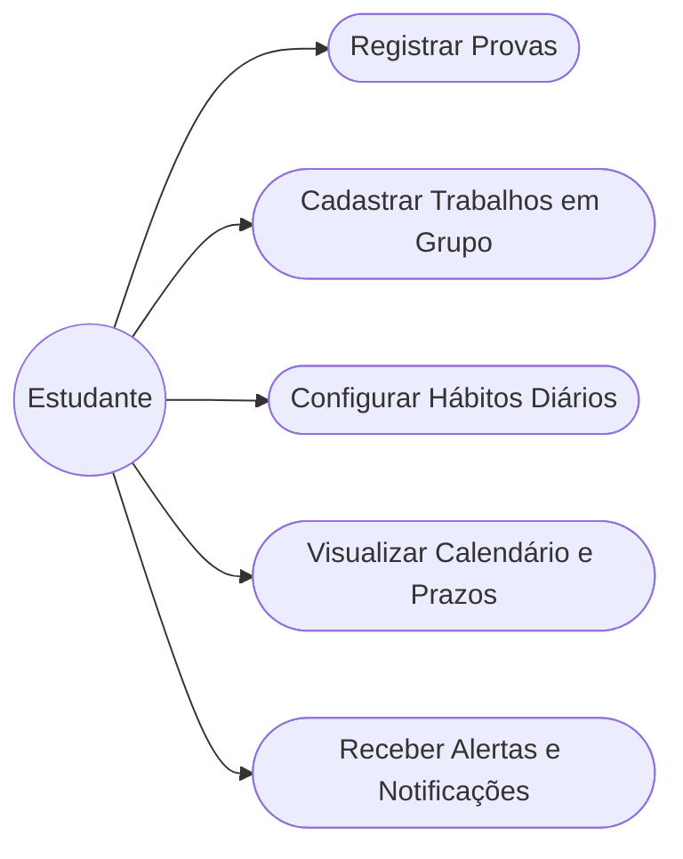
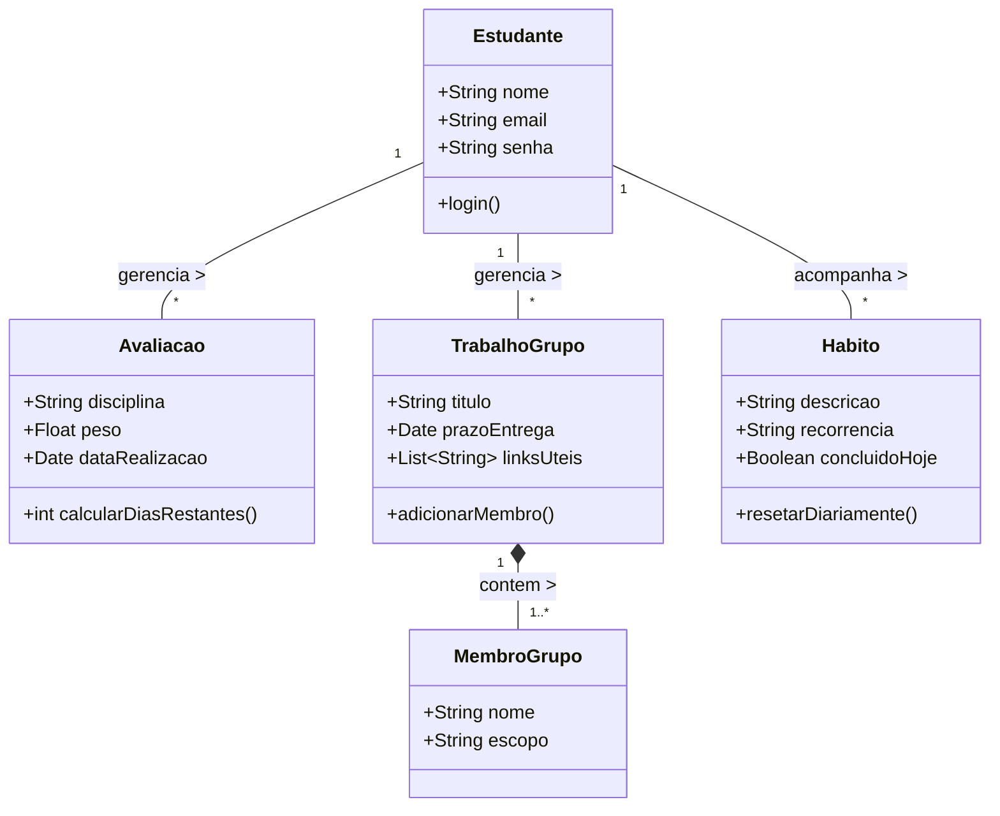

# TP1 — DCC603 - Engenharia de Software

## 👥 Integrantes

| Nome completo | Papel |
|---|---|
| Guilherme Martins Dijan Domênico | Fullstack |
| Mateus Ribeiro Quintão | Fullstack |
| Lucas Soares Benfica | Fullstack |

---

## 🎯 Objetivo do Sistema

O StudySync é uma plataforma web integrada voltada para a organização da vida acadêmica, unificando a gestão de avaliações, trabalhos em equipe e hábitos diários. O sistema visa combater a desorganização causada pela dispersão de informações, permitindo priorizar prazos críticos e rotinas de estudo. Através de um calendário interativo, contagens regressivas e visões analíticas, o aluno consegue coordenar seu tempo de forma eficiente. Dessa forma, o objetivo central é centralizar a rotina do estudante em um único ecossistema, promovendo consistência e reduzindo o estresse com entregas.

---

## 🛠️ Tecnologias

* **Frontend:** React + Tailwind CSS
* **Backend:** Node.js (com Fastify/Express)
* **Banco de Dados:** PostgreSQL (com ORM)
* **Infraestrutura:** Docker e Docker Compose
* **Agentes de IA/LLM:** Codex, Claude Code, ChatGPT (LLM), Gemini

---

## 📖 Histórias de Usuário

1. **Como** estudante, **quero** registrar minhas provas com informações de disciplina e peso, **para** ter uma contagem regressiva automática dos dias restantes.
2. **Como** estudante, **quero** cadastrar trabalhos em grupo e identificar os membros, **para** facilitar a divisão de escopo e o controle de status das entregas.
3. **Como** estudante, **quero** configurar hábitos e tarefas recorrentes (ex: monitorias), **para** acompanhar minha consistência por meio de um checklist diário.
4. **Como** estudante, **quero** visualizar todos os meus compromissos em um calendário interativo com filtros por cor, **para** organizar meu planejamento mensal e semanal.
5. **Como** estudante, **quero** acessar abas dedicadas como "Próximas Provas" e "Meu Dia", **para** focar rapidamente no que é mais urgente.
6. **Como** estudante, **quero** receber alertas e notificações programadas via e-mail ou app, **para** nunca perder o prazo de uma avaliação ou entrega crítica.
7. **Como** estudante, **quero** anexar links úteis e diretrizes dos professores aos trabalhos, **para** centralizar todo o material necessário para a execução.
8. **Como** estudante, **quero** que meu checklist de hábitos resete automaticamente à meia-noite, **para** que eu possa iniciar um novo ciclo diário sem esforço manual.

---

## 📐 Diagramas UML (Preliminar)

Conforme os requisitos do projeto, abaixo estão dois diagramas arquiteturais iniciais para guiar o desenvolvimento.

### 1. Diagrama de Casos de Uso (Mermaid)

### 2. Diagrama de Classes (Mermaid)

---

## 🤖 Regras de IA do Projeto

Este repositório possui diretrizes estritas que qualquer LLM ou Agente de IA que gerar/alterar código **deve** seguir, baseadas na documentação oficial da disciplina.
As regras completas para IAs estão localizadas em: **[AI_RULES.md](./AI_RULES.md)** (também replicadas em arquivos como `.cursorrules` e `.clinerules`).

*Principais regras:* Commits com máximo de 100 LOC (exceto com justificativa documentada), uso obrigatório de **Conventional Commits**, geração de código legível e limpo voltado para aprovação humana e não perder tempo criando testes automatizados no escopo do TP1.
