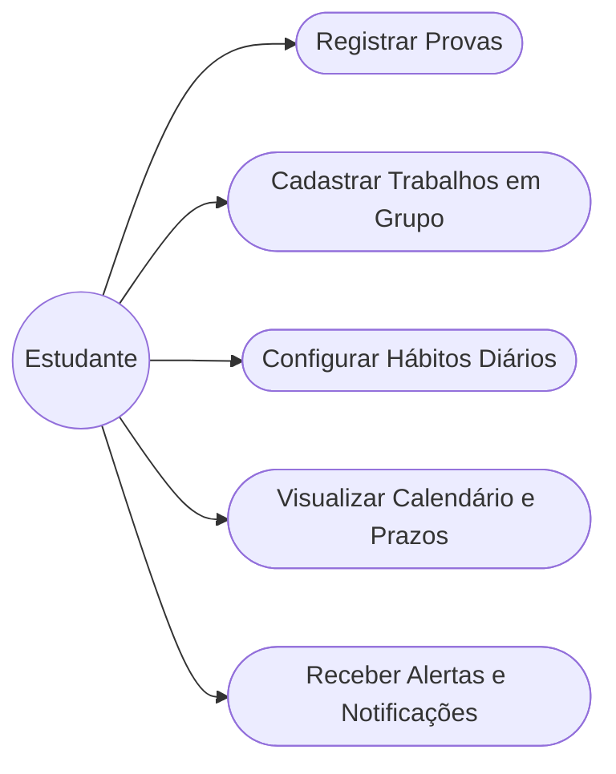
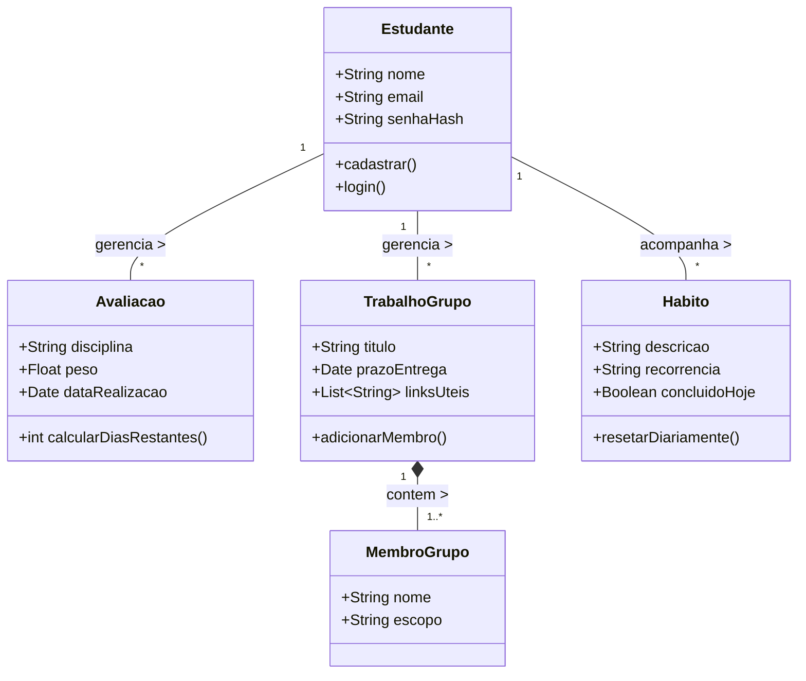
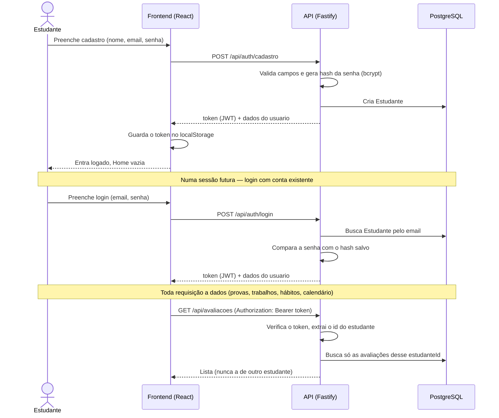

# TP1 — DCC603 - Engenharia de Software

## 👥 Integrantes

| Nome completo | Papel |
|---|---|
| Guilherme Martins Dijan Domênico | Fullstack |
| Mateus Ribeiro Quintão | Fullstack |
| Lucas Soares Benfica | Fullstack |

---

## 🎯 Objetivo do Sistema

O StudySync é uma plataforma web integrada voltada para a organização da vida acadêmica, unificando a gestão de avaliações, trabalhos em equipe e hábitos diários. O sistema visa combater a desorganização causada pela dispersão de informações, permitindo priorizar prazos críticos e rotinas de estudo. Através de um calendário interativo, contagens regressivas e visões analíticas, o aluno consegue coordenar seu tempo de forma eficiente. Dessa forma, o objetivo central é centralizar a rotina do estudante em um único ecossistema, promovendo consistência e reduzindo o estresse com entregas.

---

## 🛠️ Tecnologias

* **Frontend:** React + Tailwind CSS
* **Backend:** Node.js (com Fastify)
* **Banco de Dados:** PostgreSQL (com Prisma ORM)
* **Infraestrutura:** Docker e Docker Compose
* **Agentes de IA/LLM:** Codex, Claude Code, ChatGPT (LLM), Gemini

---

## 📖 Histórias de Usuário

1. **Como** estudante, **quero** registrar minhas provas com informações de disciplina e peso, **para** ter uma contagem regressiva automática dos dias restantes.
2. **Como** estudante, **quero** cadastrar trabalhos em grupo e identificar os membros, **para** facilitar a divisão de escopo e o controle de status das entregas.
3. **Como** estudante, **quero** configurar hábitos e tarefas recorrentes (ex: monitorias), **para** acompanhar minha consistência por meio de um checklist diário.
4. **Como** estudante, **quero** visualizar todos os meus compromissos em um calendário interativo com filtros por cor, **para** organizar meu planejamento mensal e semanal.
5. **Como** estudante, **quero** acessar abas dedicadas como "Próximas Provas" e "Meu Dia", **para** focar rapidamente no que é mais urgente.
6. **Como** estudante, **quero** receber alertas e notificações programadas via e-mail ou app, **para** nunca perder o prazo de uma avaliação ou entrega crítica.
7. **Como** estudante, **quero** anexar links úteis e diretrizes dos professores aos trabalhos, **para** centralizar todo o material necessário para a execução.
8. **Como** estudante, **quero** que meu checklist de hábitos resete automaticamente à meia-noite, **para** que eu possa iniciar um novo ciclo diário sem esforço manual.

---

## 📐 Diagramas UML (Preliminar)

Conforme os requisitos do projeto, abaixo estão os diagramas arquiteturais do sistema.

### 1. Diagrama de Casos de Uso (Mermaid)


```mermaid
flowchart LR
    E((Estudante))
    
    UC1([Registrar Provas])
    UC2([Cadastrar Trabalhos em Grupo])
    UC3([Configurar Hábitos Diários])
    UC4([Visualizar Calendário e Prazos])
    UC5([Receber Alertas e Notificações])
    
    E --> UC1
    E --> UC2
    E --> UC3
    E --> UC4
    E --> UC5
```

### 2. Diagrama de Classes (Mermaid)

`Estudante` deixou de ser ilustrativo: com a autenticação implementada, toda `Avaliacao`, `TrabalhoGrupo` e `Habito` tem um dono de verdade no banco, e cada estudante só vê/edita os próprios dados.


```mermaid
classDiagram
    class Estudante {
        +String nome
        +String email
        +String senhaHash
        +cadastrar()
        +login()
    }

    class Avaliacao {
        +String disciplina
        +Float peso
        +Date dataRealizacao
        +int calcularDiasRestantes()
    }

    class TrabalhoGrupo {
        +String titulo
        +Date prazoEntrega
        +List~String~ linksUteis
        +adicionarMembro()
    }

    class Habito {
        +String descricao
        +String recorrencia
        +Boolean concluidoHoje
        +resetarDiariamente()
    }

    class MembroGrupo {
        +String nome
        +String escopo
    }

    Estudante "1" -- "*" Avaliacao : gerencia >
    Estudante "1" -- "*" TrabalhoGrupo : gerencia >
    Estudante "1" -- "*" Habito : acompanha >
    TrabalhoGrupo "1" *-- "1..*" MembroGrupo : contem >
```

### 3. Diagrama de Sequência — Autenticação (Mermaid)

Mostra o cadastro/login (que devolvem um token) e como esse token protege as rotas de dados a partir daí — o mesmo padrão vale para provas, trabalhos, hábitos e calendário.


```mermaid
sequenceDiagram
    actor E as Estudante
    participant F as Frontend (React)
    participant A as API (Fastify)
    participant B as PostgreSQL

    E->>F: Preenche cadastro (nome, email, senha)
    F->>A: POST /api/auth/cadastro
    A->>A: Valida campos e gera hash da senha (bcrypt)
    A->>B: Cria Estudante
    A-->>F: token (JWT) + dados do usuario
    F->>F: Guarda o token no localStorage
    F-->>E: Entra logado, Home vazia

    Note over E,B: Numa sessão futura — login com conta existente
    E->>F: Preenche login (email, senha)
    F->>A: POST /api/auth/login
    A->>B: Busca Estudante pelo email
    A->>A: Compara a senha com o hash salvo
    A-->>F: token (JWT) + dados do usuario

    Note over E,B: Toda requisição a dados (provas, trabalhos, hábitos, calendário)
    F->>A: GET /api/avaliacoes  (Authorization: Bearer token)
    A->>A: Verifica o token, extrai o id do estudante
    A->>B: Busca só as avaliações desse estudanteId
    A-->>F: Lista (nunca a de outro estudante)
```

---

## 🚀 Como Rodar o Projeto

Pré-requisito: [Docker Desktop](https://www.docker.com/products/docker-desktop/) instalado e aberto.

1. Clonar o repositório e entrar na pasta.
2. Copiar o arquivo de variáveis de ambiente: `cp .env.example .env` (no Windows: `copy .env.example .env`).
3. Subir os containers: `docker compose up --build`
4. Acessar:
   * Frontend: http://localhost:5173
   * API: http://localhost:3000/api/health
   * Postgres: `localhost:5432` (usuário/senha: `studysync`/`studysync123`)
5. (Opcional) Popular com dados de exemplo: `docker compose exec backend npm run db:seed` → cria a conta demo `demo@studysync.com` / `demo123` já com provas, trabalhos e hábitos de exemplo.
6. Parar os containers: `docker compose down` (os dados continuam salvos no volume `pgdata`; use `docker compose down -v` para apagar tudo e recomeçar do zero).

### ✉️ Ativando as notificações por e-mail (opcional)

Sem esses passos o app funciona 100% normal — só não envia e-mail de verdade (fallback silencioso). Para ativar:

1. Criar uma conta gratuita em [sendgrid.com](https://sendgrid.com).
2. **Settings → Sender Authentication → Single Sender Verification** → cadastrar um e-mail remetente e confirmar pelo link que chega na caixa de entrada dele.
3. **Settings → API Keys → Create API Key** → escolher "Restricted Access" e liberar só a permissão **Mail Send**.
4. No `.env` da raiz, preencher:
   ```
   SENDGRID_API_KEY=SG.xxxxxxxxxxxxxxxxx
   SENDGRID_FROM=<e-mail verificado no passo 2>
   ```
5. Reiniciar só o backend para carregar as novas variáveis: `docker compose up -d backend`

A partir daí, todo dia às 08h (horário de Brasília) cada estudante recebe — se tiver ativado em **Configurações** — um lembrete dos prazos dos próximos 3 dias e um aviso de quais itens acabaram de entrar em "Urgentes".

---

## 📱 Tutorial Rápido — Funcionalidades

1. **Cadastro / Login** (`/cadastro`, `/login`) — crie uma conta com nome, e-mail e senha. Cada conta só enxerga os próprios dados (provas, trabalhos e hábitos de outro estudante nunca aparecem).
2. **Meu Dia** (`/`) — visão do dia: checklist de hábitos e a seção **🚨 Urgentes**, que reúne provas/trabalhos com o alarme já ativo, marcando em vermelho "Atrasado" quando o prazo passou sem o item ser concluído.
3. **Provas** (`/provas`) — cadastro com disciplina, peso e data da prova. O campo "alarme" é opcional: se deixado em branco, o sistema sugere automaticamente uma data alguns dias antes do prazo.
4. **Trabalhos** (`/trabalhos`) — trabalhos em grupo com membros (nome + parte de que cada um é responsável), status (pendente / em andamento / concluído) e links úteis (enunciados, materiais de apoio).
5. **Hábitos** (`/habitos`) — tarefas recorrentes (diárias ou semanais) com checklist que reseta sozinho à meia-noite (fuso de Brasília).
6. **Calendário** (`/calendario`) — visão mensal e semanal de tudo, com filtros por tipo (prova / trabalho / hábito).
7. **Configurações** (`/configuracoes`) — liga/desliga, individualmente, o lembrete diário por e-mail e o aviso de itens que entraram em "Urgentes".

---

## 🤖 Regras de IA do Projeto

Este repositório possui diretrizes estritas que qualquer LLM ou Agente de IA que gerar/alterar código **deve** seguir, baseadas na documentação oficial da disciplina.
As regras completas para IAs estão localizadas em: **[AI_RULES.md](./AI_RULES.md)** (também replicadas em arquivos como `.cursorrules` e `.clinerules`).

*Principais regras:* Commits com máximo de 100 LOC (exceto com justificativa documentada), uso obrigatório de **Conventional Commits**, geração de código legível e limpo voltado para aprovação humana e não perder tempo criando testes automatizados no escopo do TP1.
